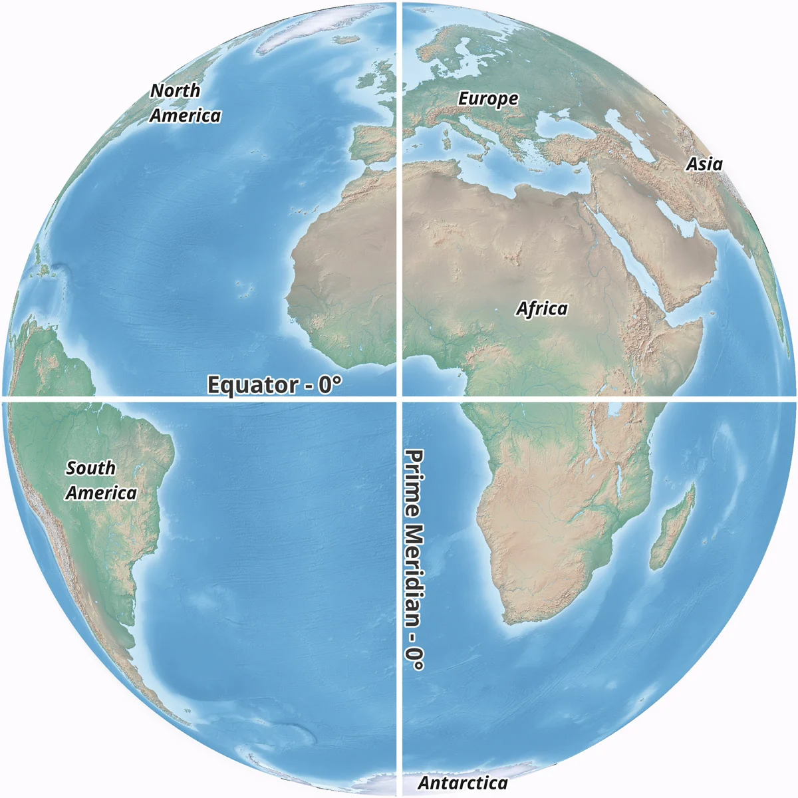

```{r setup, include=FALSE}
knitr::opts_chunk$set(echo = TRUE) 
```

# Learning Objectives

Welcome to R Geospatial Fundamentals. Our goals for today's workshop are:

**1. Define Geospatial data**

**2. Understand the content of spatial dataframes and the different geometry types**

**3. Navigate different coordinate reference systems (CRS)**

------------------------------------------------------------------------

## **Define geospatial data**

Why: establish the basis of what defines the type of data we are working with

Geospatial data is information encoded with a specific location using coordinates. It is made of attributes (what), representing the data associated a particular location(where). These attributes could range from environmental factors to demographic details.

Example: Alameda High School

Attributes (what): number of students, year founded, school district etc.

Location (where): 37°45'49"N 122°14'49"W


[link to image](https://earth.google.com/web/search/alameda+countyAlameda+School+of+Science+and+Technology+Institute/@37.78345078,-122.26452684,6.88126536a,12712.43189645d,35y,0.00000002h,0t,0r/data=Cq0BGoIBEnwKJTB4ODA4ZjgwZDkxMTg2YWM0NToweGVlMDRmYjdhNjJkMmE1NmQZhAdy9QjkQkAhVzYYj_eRXsAqQWFsYW1lZGEgY291bnR5IEFsYW1lZGEgU2Nob29sIG9mIFNjaWVuY2UgYW5kIFRlY2hub2xvZ3kgSW5zdGl0dXRlGAIgASImCiQJeQ0TQrABQ0ARMQILYcSrQkAZLBUvKRFKXsAh7Qp9U-KrXsA6AwoBMA)

\*\* geospatial data also often comes with additional data that provides cotext, termed metadata. This could include information about where the geospatial data was obtained (the data source) or the date of last update of the data.

------------------------------------------------------------------------

## Examine the content of a spatial df

Why: An understanding of the structure of spatial dataframes allows for accurate manipulation and analysis

*Let's visualize the information contained within a spatial dataframe*

[Load Libraries]{.underline}

```{r}

library(here) #provides a here() command that builds file paths from the project directory
library(sf)

```

\*\* SF = simple features; package designed to simplify analysis of spatial data

[Read in a spatial dataframe]{.underline}

```{r}

# Read in the data
?st_read

schools_sf = st_read(here("data",
                               "California_Schools_2019-20",
                               "SchoolSites1920.shp")) #shp = one of the main geospatial file types (), part of a dataset

#data source: https://gis.data.ca.gov/datasets/f7f818b0aa7a415192eaf66f192bc9cc
```

-   spatial data, like any other, is stored in a specific file type. The [ESRI shapefile](https://en.wikipedia.org/wiki/Shapefile) is the most widely used type of file format for storing geospatial (vector) data. It has a `.shp` file ending. This is the file we will read in and it is part of a collection of files, with endings `.shx`, `.dbf`, and `.prj` that need to be stored in the same location.

-   The output is metadata. We're going to go over most of what is contained bit by bit throughout the lesson.

To make to make it relatable, let's first see how the data we loaded is similar to a base R dataframe

------------------------------------------------------------------------

## Identify congruencies between base R and spatial dataframes

why: makes the transition into geospatial analysis more intuitive

Working with spatial dataframes is similar to working with base R dataframes

-   An sf spatial dataframe retains all of the functionality of an R `data.frame`, extended with a geometry column and metadata about the geometry column.

-   The sf package provides additional capabilities for handling and processing these 'extended', spatial components of the spatial dataframe

-   This makes it possible to process your data using both standard table-based operations and explicitly geospatial operations from the `sf` library.

[Explore spatial dataframe]{.underline}

```{r}

#Look at the type of R objects as sf dataframe is 
class(schools_sf)

#View the dataframe (and see its similarities to a base R dataframe)
View(schools_sf) 

#Look at the size of the dataframe
dim(schools_sf) 

```

Note: when referencing geospatial data (like the schools_sf dataframe)

-   attributes = columns containing data

-   features = rows

    -   each feature has associated geometry column

```{r}

# Look at all the variables included in our data
colnames(schools_sf) 
```

Note: All spatial data (vector) has an associated geometry column. This column is fundamental to the definition of an sf dataframe.

🔔 **Question**: Which base R dataframe functions are applicable to spatial dataframes (think of one we haven't used yet)

------------------------------------------------------------------------

## Identify the different geometry types

Why: recognizing different geometry types allows for nuanced representation of various geographic features

There are three main types of geometries that can be associated with a spatial dataframe (an `sf` object): points, lines and polygons:


The geometry column defines the type and location of the geometry

[Explore geometry of spatial dataframe]{.underline}

```{r}

#view the geometric information of this spatial dataframe 
st_geometry(schools_sf) 
schools_sf$geometry 
```

This summary of the information pertaining to the geometry includes information such as

-   number of features (or rows)

-   the type of geometry---point---referring to the location of the schools

-   the dimension is the coordinate system that describes the data. Here the are 2 dimensions (2-D): the X and Y axis. we can have 3D: XYZ, where Z is elevation

-   the bounding box is the outer limits in the coordinate system (XY) that contain, or bound, the data. This represents the geographic scope covered by the dataset

-   CRS: which we will cover in the next section

-   First 5 geometries

The three main types of geometries (point, line, polygon) have their multi-equivalents (multiline, multipoint, & multipolygon). These account for irregular or complex shapes, disconnected or intersecting boundaries etc.

## 🥊 Challenge 1: Exploring More Complex Geometry Types

Pick a country. Look up its population and create a variable which stores the population. Now look up the GDP (Gross Domestic Product) and create another variable which stores the GDP.

Can you use these two variables to create a third variable which stores the GDP per capita (GDP divided by population)?

Read in the California Counties shapefile; 'CaliforniaCounties.shp' and store it as a variable 'counties'.

-   The data is found in the 'data' folder, 'california_counties' sub-folder.

1.  Determine the geometry type

[Explore complex geometries]{.underline}

```{r}
# You may have some starter code for the challenge that you can put in its own cell.
# Always have a following cell that says "YOUR CODE HERE" with a few empty lines beneath it, so that attendees know where to put their code.
```

```{r}
# YOUR CODE HERE

```

[Solution]{.underline}

```{r}

#read in the counties shapefile
counties = st_read(dsn = here("data",  #dsn= data source name
                              "california_counties", 
                              "CaliforniaCounties.shp"))

#look at the first few rows of the data
head(counties)

# identify the geometry type
counties$geometry
#or
st_geometry(counties)

#data source: 
```

🔔 **Question**: Why would data on county boundaries be best represented as a multipolygon?

------------------------------------------------------------------------

## **Navigating Coordinate Reference Systems**

why: understanding coordinate reference systems including encoding, transformation, and selection, ensures accurate integration of spatial data from various sources.

A coordinate reference system (CRS) is a system for associating a position on the surface of the Earth, with numerical coordinates. The 'center of the earth is 0 degrees longitude (prime meridian), and 0 degrees latitude (equator).



[Link to image](https://www.geographyrealm.com/zero-degrees-latitude-and-zero-degrees-longitude/)

There are many different CRS's and types of CRS's because the Earth is a complex surface with curvature and elevation. In representing these 3-dimensional aspects via a 2-dimensional map, various aspects become distorted. Additionally, maps change as our understanding of the earth evolves, and different types of maps better represent different aspects of the Earth.

Let's explore two distinct CRS'

------------------------------------------------------------------------

### A. Geographic vs. projected CRS


[link to image](https://www.esri.com/arcgis-blog/products/arcgis-pro/mapping/gcs_vs_pcs/)

Geographic Coordinate System:

-   designed to maintain the shape of continents

-   uses latitude and longitude to specify locations on the Earth's surface.

-   suitable for global references and large-scale datasets

-   uses angular units; degrees

Projected Coordinate System:

-   designed for accurate representation of distances, areas, angles and shapes

-   uses x and y coordinates on a flat surface for mapping.

-   suitable for mapping and navigation

-   uses linear units; feet, meters etc.

-   All map projections introduce distortion in area, shape, distance or direction

-   Various projection methods are used to preserve specific properties, such as area, shape, distance, or direction, depending on the application requirements.

### B. CRS Codes

You need to know the coordinate reference system of your input data in order to accurately work with the data.

CRSs are referenced by a common names and, in software, by numeric codes, often called EPSG codes

-   global applications benefit from geographic CRS like WGS84 (EPSG 4326)

-   regional analyses, such as census data interpretation, often use localized geographic CRS like NAD83 (EPSG 4269).

-   Projected CRS, such as Web Mercator, are ideal for online maps, while state-specific CRS like CA Albers Equal Area cater to localized precision in areas like California.

[View CRS Codes]{.underline}

```{r}

#view the CRS of the spatial dataframe
st_crs(counties)
```

CRS: "Projected CRS: NAD83 / California Albers"

-   based on satellites and survey data

-   best fit for USA

-   used by many federal data products, like Census data

```{r}

#view the CRS of the spatial dataframe
st_crs(schools_sf)
```

CRS: "Geodetic CRS: WGS 84"

-   a three-dimensional coordinate system (latitude, longitude, and ellipsoidal height)

-   accounts for earths curvature and shape- represented by an ellipsoid.

```{r}

#another way to view the CRS codes
#view the spatial dataframe goemetry, include the CRS code
st_geometry(counties)
```

------------------------------------------------------------------------

### C. CRS Reprojections

[Check and transform CRS Codes]{.underline}

```{r}

#First, get CRS of the spatial dataframe 
st_crs(schools_sf) #WGS84
st_crs(counties) #NAD83

#check if the CRS's are the same
st_crs(schools_sf) == st_crs(counties) 

```

-   Change the CRS to a known CRS based on the EPSG code, or based on CRS of another spatial dataframe

```{r}

# change the CRS of the schools spatial dataframe to a different CRS based on a known EPSG code
# Say we know that NAD83 has EPSG 4269
schools_sf_4269 = st_transform(schools_sf, crs = 4269) 

st_crs(schools_sf_4269)

# change the CRS of the schools spatial dataframe to match the counties dataframe
schools_sf_NAD83 = st_transform(schools_sf, crs= st_crs(counties))

```

```{r}

#check if the CRS's are the same
st_crs(schools_sf_4269) == st_crs(schools_sf_NAD83)
st_crs(schools_sf_NAD83) == st_crs(counties) 

```

🔔 **Question**: Why do you think the second logic expression is FALSE?

This method of assigning a CRS based on a spatial dataframe is preferred when trying to do analysis with multiple dataframes. This is because although data may be in the same CRS they could have very slightly different CRS metadata that could cause an error later on.

------------------------------------------------------------------------

## Creating a Spatial dataframe

There are various sources of spatial data, [USGS](https://earthexplorer.usgs.gov/), [EJ Screen](https://www.epa.gov/ejscreen), a countrywide census, [NASA](https://www.earthdata.nasa.gov/learn/gis), and internet search of 'geospatial data for X data in Y location', etc. that come formatted for direct use (e.g. come as a .shp file).

In other instances, you may have spreadsheet data that needs to be converted into a spatial dataframe. Spreadsheet data, like data saved in a .csv file format, can be transformed in to a spatial dataframe give 2 pieces of information

-   the data contains columns that specifying the point coordinates associated with each attribute

-   identifying the CRS of the data

We can use the function `st_as_sf` to transform it into an `sf` spatial data.frame.

[Create a spatial dataframe from a CSV file]{.underline}

```{r}

#read in a CSV file containing information on schools in Alameda county
alameda_schools_df <- read.csv(here("data",
                                    "alameda_schools",
                                    "alco_schools.csv"))

#view the contents of the dataframe
View(alameda_schools_df)
```

🔔 **Question**:

```{r}

?st_as_sf
alameda_schools_sf <- st_as_sf(schools_df, 
                       coords = c('X','Y'), #column names containing location data
                       crs = 4326) #known CRS of the data 
```

[Save a spatial dataframe]{.underline}

the `st_write` function allows you save

```{r}

# Save to shapefile, deleting existing file if present
st_write(alameda_schools_sf, 
         here("data", #stating where we want to save the data
              "alameda_schools.shp"),
         delete_dsn = T) #this allows us to overwrite the existing alameda_county files 

#note the .dbf, .prj, .shx files that are also created
```

-   other geospatial file types include [.geojson](https://geojson.org/) or .[gpkg](https://www.geopackage.org/). Read more to understand benefits and nuances of these different file types.

## 🥊 Challenge 2: ...

Pick a country. Look up its population and create a variable which stores the population. Now look up the GDP (Gross Domestic Product) and create another variable which stores the GDP.

Can you use these two variables to create a third variable which stores the GDP per capita (GDP divided by population)?

```{r}
# You may have some starter code for the challenge that you can put in its own cell.
# Always have a following cell that says "YOUR CODE HERE" with a few empty lines beneath it, so that attendees know where to put their code.
```

```{r}
# YOUR CODE HERE

```

## Key Points

-   ...
